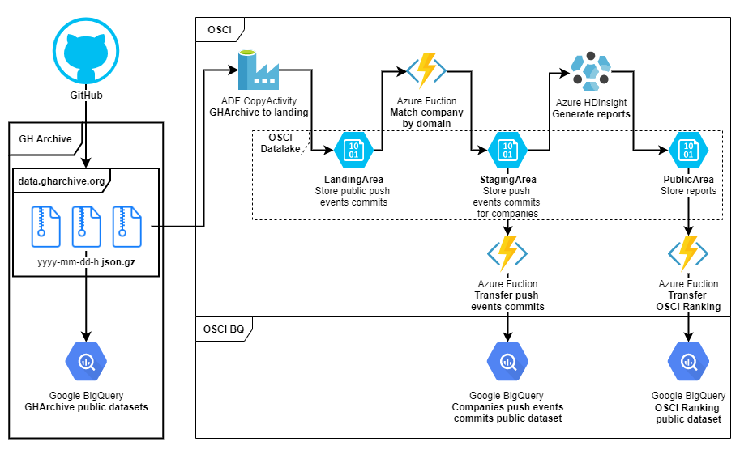


# OSCI, the Open Source Contributor Index

## NEWS UPDATE (September 8th 2020)

The OSCI ranking has now been updated with the data for August 2020.

The latest ranking can be viewed on the EPAM SolutionsHub [OSCI page](https://solutionshub.epam.com/osci).
Alternatively the updated ranking can be downloaded (Excel format) from our [Archive folder](Archive): [2020.08 OSCI Ranking.xlsx](Archive/2020.08_OSCI_Ranking.xlsx).

The latest data shows that Google have strongly established themselves in the #1 position.

Also why not take a look at our [newly-published blog page](https://solutionshub.epam.com/blog/post/open-source-osci-2016-2020-analysis) analyzing the OSCI rankings from 2016 until mid-2020.

## What is OSCI?

* OSCI ranks corporate contributions to open source based on the organization’s number of Active Contributors to GitHub
* OSCI also tracks the Total Community of open source contributors for these companies
* The OSCI rankings are published monthly to dynamically track corporate contributions to GitHub. The latest result can be found at EPAM SolutionsHub website's [OSCI page](https://solutionshub.epam.com/osci)

## How does OSCI work?

* OSCI analyses push event data from [GH Archive](https://www.gharchive.org/)
* The Author Email address field in the commit event data is used to identify the organization to which the commit author belongs
* OSCI measures the Active Community (10+ commits) and the Total Community (1+ commit) at each organization
* Analysis is done for the current year-to-date
* OSCI’s algorithm is transparently published as an open source project on GitHub




## How did we decide on the ranking logic?

We realize that there are many approaches which could be used to develop this ranking. We experimented extensively with these before arriving at the logic now used.

We concluded the Author's Email Domain in the Push Event data is the most reliable way to identify the organization to which a commit author belongs. It is a single unambiguous identifier. 
It is true that many people on GitHub do not use the email address of their employer or keep it private, but it is still a more reliable single measure compared with alternatives.  The org of the repo is not a good measure of the employer of an individual because the employees of most companies maintain projects in multiple GitHub orgs.

We concluded that 10+ commits in a year - while arbitrary - is a reasonable measure of whether a person is an active contributor to GitHub. 
It is interesting to compare this with the size of the broader community at an organization - this is why we also record the number of people with just 1 or more commits in the time period.

We decided to base the ranking on the number of people making commits, rather than the number of commits.  The GitHub push event data includes large numbers of pushes made by automated processes using an email domain from an organization. Counting the number of pushes is not a good measure of the community at an organization, when the results are considerably skewed by these automated processes. 

Our technical design assessed multiple source of data and we concluded that [GHArchive](https://www.gharchive.org/) is best suited for our needs, based on ease of access to the data, the amount of data it records, and the size of the data. 
[GHTorrent](http://ghtorrent.org/) is also very interesting for  future use, since it contains a richer set of data, however the data sizes are considerably larger which drove our decision to go with GHArchive.

## What does OSCI not do?

OSCI does not include educational and research institutions, contributions from free email providers, etc. The focus is on commercial organizations.

## Prior work in this area

Our inspiration for OSCI is the work done earlier in the Open Source community, so we wish to give credit to these:
* GitHub published an analysis for 2016 which included the organizations with the most open source contributors https://octoverse.github.com/2016/. GitHub have also published similar studies in 2017 and 2018.
* Felipe Hoffa published a detailed analysis of 2017 data at https://medium.freecodecamp.org/the-top-contributors-to-github-2017-be98ab854e87. Felipe's logic used email domain to identify organizations, counted commits only to projects with more than 20 stars during the period, and counted users with more than 3 pushes during the period. Further details are available in the article.
* Fil Maj also analysed 2017 data and counted users with 10 or more commits during the period https://www.infoworld.com/article/3253948/who-really-contributes-to-open-source.html


## Where can I see the latest rankings
This project is created by EPAM Systems and the latest results are visible on the EPAM SolutionsHub [OSCI page](https://solutionshub.epam.com/osci). The results will be updated and published each month.

## How I can contribute to OSCI
If you would like to contribute to OSCI, please take a look at our guidelines [here.](CONTRIBUTING.md)

## What if your think your organization is missing or you believe there is an error in our logic
This is a new project. We are more than happy to listen to any feedback which will help us improve.
Contact us at [OSCI@epam.com](mailto:OSCI@epam.com) or modify the companies filter yourself.

## How can I add a company which is missing from the OSCI ranking
The goal of the OSCI is to rank the GitHub contributions by companies (commercial organizations).

In order to add a company to the OSCI ranking, do the following:

1) Check whether the organization you propose to add matches our definition of a company:
- is not an educational, governmental, non-profit or research institution;
- is not a free-mail, like gmail.com, yahoo.com, hotmail.com, etc;
- is a registered, commercial company;
- a simple "rule of thumb" - does the organization's website sell a product or service?  If not, it is probably not a company by our definition.

1) Create a new pull request.

1) Go to company domain match list ([company_domain_match_list.yaml](__app__/match_company/company_domain_match_list.yaml))

1) Confirm that the company you wish to add is not listed.

1) Add the **main domain** of the company and the company name to the table. For example:
    ```yaml
    - company: Facebook
      domains:
        - fb.com
      regex:
    ```     
1) If the company has more than 1 email domain for its employees, add all of them to block `domains` (or `regex` for using regular expression). For example:
    ```yaml
    - company: Facebook
      domains:
        - fb.com
        - facebook.com
      regex:
        - ^.*\.fb\.com$
        - ^.*\.facebook\.com$
    ```

We will review your pull request and if it matches our requirements, we will merge it. 

# QuickStart
## Technical Note
We built OSCI this an Azure cloud environment using Azure DataFactory, Azure Function and Azure HDInsight. 
The code published here on GitHub does not require the Azure cloud. You can reproduce everything in the corresponding instruction with cli.
## Installation
1) Clone repository
    ```shell script
         git clone https://github.com/epam/OSCI.git
    ```
1) Go to project directory
    ```shell script
         cd OSCI
    ```
1) Install requirements
    ```shell script
         pip install -r requirements.txt
   ```

## Configuration
Create a file `local.yml` (by default this file added to .gitignore) in the directory [`__app__/config/files`](__app__/config/files). 
A sample file [`default.yml`](__app__/config/files/default.yml) is included, please don't change values in this file

## Sample run
1) Run script to download data from archive (for example for 01 January 2020)
    ```shell script
         python3 osci.py get_github_daily_push_events -d 2020-01-01
    ```
1) Run script to add company field (matched by domain) (for example for 01 January 2020)
    ```shell script
         python3 osci.py process-github-daily-push-events -d 2020-01-01
    ```
1) Run script to add company field (matched by domain) (for example for 01 January 2020)
    ```shell script
         python3 osci.py daily-osci-rankings -td 2020-01-02
    ```
  
# License
OSCI is [GNU General Public License v3.0](LICENSE).
